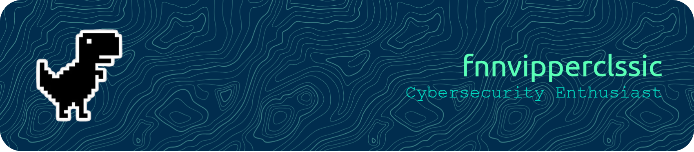

<!-- ============================================================
     🚀 PROFILE HEADER – Name + Dynamic Tagline
     ============================================================ -->

<h1 align="center">
  
</h1>

  
   
  <em>“No technology is 100% safe! The only way to be completely safe is to stay away from technology completely.”</em>

---

<!-- ============================================================
     👤 ABOUT ME – Who I am, what I do, my mission
     ============================================================ -->

<table>
<tr>
<td width="50%" valign="top">

Hi, I'm **fnnvipperclssic** – a cybersecurity enthusiast with a relentless curiosity for breaking things (ethically) and building resilient defenses.  
My journey began with a simple question: *“How does this break?”* – and that question evolved into a mission to make the digital world safer, one vulnerability at a time.

<ul>
  <li>🔍 <strong>Bug Bounty Hunter</strong> – Active on project research</li>
  <li>🛡️ <strong>Certified Networking</strong> – CCNA ITN, Junior Network Administrator BNSP</li>
  <li>⚡ <strong>Currently researching:</strong> Web security, API exploitation, Network Anomaly</li>
  <li>🎯 <strong>CTF Enthusiast</strong> – Regular on competition event</li>
  <li>📖 <strong>Learning:</strong> Malware Analysis, Web Attack, Vulnerable System and Configuration</li>
</ul>

</td>
<td width="50%" valign="top">

## 🧑‍💻 About Me

  
   
  <em>“Hackers are not criminals, but crackers are the real criminals”</em>

</td>
</tr>
</table>

---

<!-- ============================================================
     🏅 CERTIFICATIONS & ACHIEVEMENTS
     ============================================================ -->

## 🏆 Certifications & Achievements

  
  
  
  

  🥇 <strong>CTF Event RKS 2025:</strong> 2nd place in CTF event &nbsp;|&nbsp;
  📝 <strong>CVEs Published:</strong> 0 &nbsp;|&nbsp;
  ✍️ <strong>Security Writeups:</strong> 1+

---

<!-- ============================================================
     🛠️ TOOLS & TECH STACK
     ============================================================ -->

## 🧰 Arsenal & Tools of the Trade

  
  
  
  
  
  
  
  
  
  
  
  
  
  
  
  
  
  
  
  
  
  
  
  
  
  
  
  
  
  

---

<!-- ============================================================
     📊 GITHUB STATS – Activity, languages, streak, trophies
     ============================================================ -->

## 📈 GitHub Stats & Activity

<table>
  <tr>
    <td align="center">
      
    </td>
    <td align="center">
      
    </td>
  </tr>
  <tr>
    <td align="center">
      
    </td>
    <td align="center">
      
    </td>
  </tr>
</table>

---

<!-- ============================================================
     👀 PROFILE VISITS
     ============================================================ -->

  

---

<!-- ============================================================
     🐍 CONTRIBUTION SNAKE
     ============================================================ -->

## 🐍 Contribution Snake

<picture>
  <source media="(prefers-color-scheme: dark)" srcset="https://raw.githubusercontent.com/fnnvipperclssic/fnnvipperclssic/snake-output/github-contribution-grid-snake-dark.svg">
  <source media="(prefers-color-scheme: light)" srcset="https://raw.githubusercontent.com/fnnvipperclssic/fnnvipperclssic/snake-output/github-contribution-grid-snake.svg">
  
</picture>

---

<!-- ============================================================
     🕹️ PACMAN – Contribution Graph Animation
     ============================================================ -->

## 🕹️ Contribution Arcade

  <picture>
    <source media="(prefers-color-scheme: dark)" srcset="https://raw.githubusercontent.com/fnnvipperclssic/fnnvipperclssic/pacman-output/bomberman-contribution-graph.svg">
    
  </picture>

---

<!-- ============================================================
     🎵 SPOTIFY – Recently Played Tracks
     ============================================================ -->

## 🎵 What I'm Listening To

  

  🎧 Powered by <a href="https://github.com/JeffreyCA/spotify-recently-played-readme" target="_blank">spotify-recently-played-readme</a>

---

<!-- ============================================================
     📝 RECENT RESEARCH & WRITEUPS
     ============================================================ -->

## 🔥 Recent Security Research & Writeups

- 🚨 **[CTF Rekayasa Keamanan Siber 2025]** – Deep dive into crack of Cruptography in Flag CTF.  
  👉 [Read more](link)
- 🛡️ **[Attack]** – How I discovered [CVE-2026-Web Server Nginx] and responsibly disclosed it.  
  👉 [Read more](link)
- 📝 **[Attack & Defense]** – Red teaming strategies for modern web environments.  
  👉 [Read more](link)

---

<!-- ============================================================
     📌 FEATURED PROJECTS
     ============================================================ -->

## 📦 Featured Security Projects

| Project | Description | Stack |
|---------|-------------|-------|
| **Suaka CuanKu** | Web applications for digital loan Access | NodeJS, NextJS, PostgreSQL |
| **ElSuarKu** | Application Mobile for voting and vote monitoring  | Kotlin |
| **Ecvaultz** | Web Digital Vault basic Laravel Framework | Laravel, InertiaJS, Vite |

---

<!-- ============================================================
     🌐 SOCIAL LINKS
     ============================================================ -->

## 🌍 Let’s Connect

  
  
  
  
  

---

<!-- ============================================================
     🕊️ FINAL QUOTE & SIGN-OFF – redesigned (clean, side‑by‑side GIFs)
     ============================================================ -->

 

> *“Security isn't a product — it's a process, a mindset, and a continuous journey.”*  
> Stay curious. Stay ethical. Hack the planet (legally). 🌍

 

<!-- Dua GIF ditampilkan sejajar, ukuran 280px, dengan efek bayangan lembut -->

  

    
    
  

 

---

  <i>If this work helped or inspired you, drop a ⭐ on a repo – it means a lot.</i>

